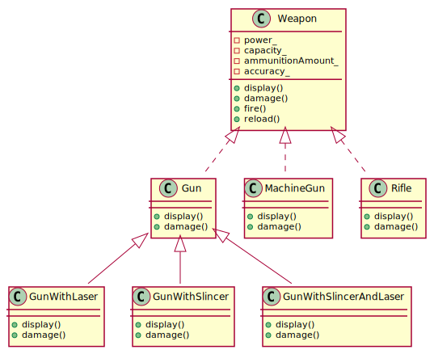
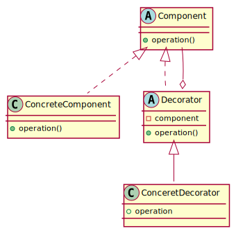
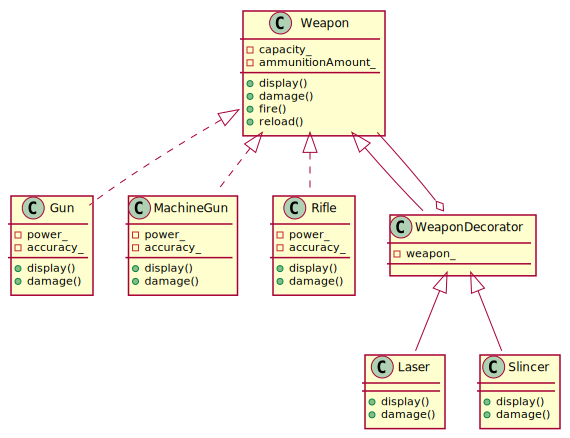

# decorator-pattern-lesson

## Modern-DOOM

On your new position of junior game developer in project of game Modern-DOOM you get task to write weapon system.

## Your first task - game weapon system

The task is simple you need to implement system for three weapons:

* Gun
* Machinegun
* Rifle

Each of those weapons should have possibility to mount:

* Laser (increase damage by 0.1 factor)
* Slincer (increase damage by 5)

Each weapon should have:

* Methods:
  * fire()
  * reload()
  * display()
* Fields:
  * power
  * accuracy
  * capacity

## Your first attepmt

Initial version of WeaponSystem which you produced is called **BadWeaponSystem**, reason of that name comes from system design and it's difficulties with extensions.

## New requirements - Problem

Game is getting more popular and players get bored using only 3 weapons also they want more extensions for weapons. Company want to make game more interesting and challenging.

You get task to add more stuff to game:

* Weapons:

  * SniperRifle
  * Shotgun
  * Carabin
  * Bazooka

* Extensions:
  * Lunette
  * ImprovedAmmunitionModule
  * AimingHolder
  * CammoSkin

## Solution to the problem - decorator pattern

You realise that you will have a lot of work. Also in future you will must write a lot of new code. There must be a better solution for this weapon system. This solution is called Decorator Design Pattern.

## Decorator Design Pattern

**The Decorator Pattern** attaches additional responsibilites to an object dynamically. Decorators provide a flexible alternative to subclassing for extending functionality.

Decorator helps you to follow  of open/close rule from S(O)LID principle :)

## Refactoring of weapon system code using decorator pattern

You rewrited your weapon system using *Decorator Design Pattern* and created **GoodWeaponSystem** which will be very easy to extend without modifying existing code and will make your live easier during future releases of the game.

## Homework

Fork repo and work on branch *homework*

* Add to GoodWeaponSystem stuff mentioned in New Requirements.
* Refactor a code in CoffeShopSystem in homework directory using Decorator Patern.
  * Divide decorators(Soy, Milk, Whip) into separate code.
